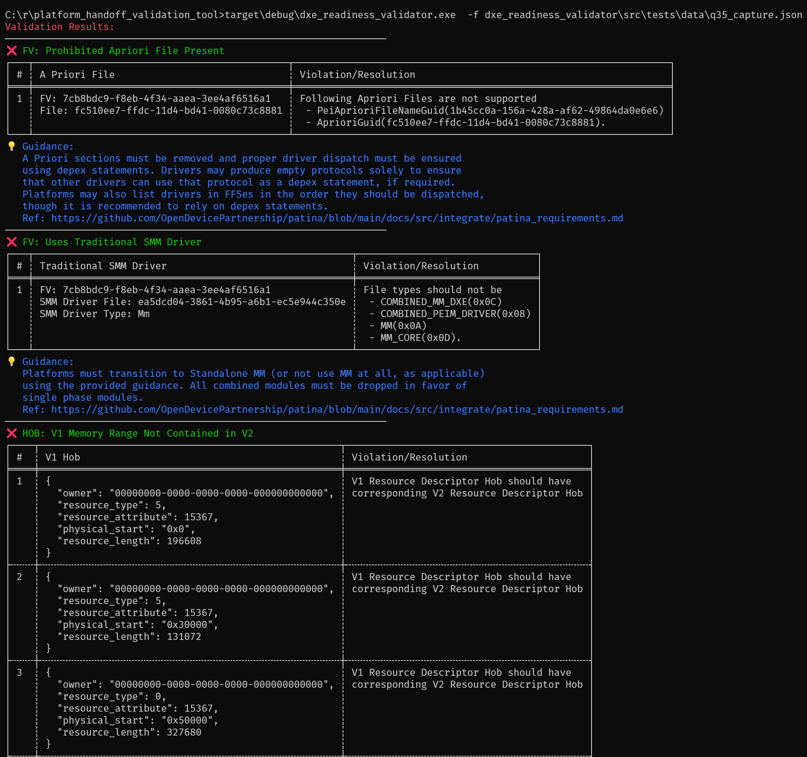

<!-- markdownlint-disable MD013 : Disable line limit.-->
# **DXE Readiness Capture/Validation Tool**

The workspace consists of two packages:

1. **DXE Readiness Capture** – An EFI application
2. **DXE Readiness Validator** – A standard Rust binary

## **Building the Packages**

Running `cargo make build` compiles both packages for all supported
architectures and targets.

| Target               | x86_64                                                               | AArch64                                                               |
| -------------------- | -------------------------------------------------------------------- | --------------------------------------------------------------------- |
| **UEFI Dxe Phase**   | target\x86_64-unknown-uefi\debug\qemu_dxe_readiness_capture.efi      | target\aarch64-unknown-uefi\debug\qemu_dxe_readiness_capture.efi      |
| **UEFI Shell Phase** | target\x86_64-unknown-uefi\debug\uefishell_dxe_readiness_capture.efi | target\aarch64-unknown-uefi\debug\uefishell_dxe_readiness_capture.efi |
| **Windows**          | target\debug\dxe_readiness_validater.exe                             | target\debug\dxe_readiness_validater.exe                              |
| **Linux**            | target\debug\dxe_readiness_validater                                 | target\debug\dxe_readiness_validater                                  |

### **Supported Hardware Platforms**

The `cargo make build` command, along with the QEMU-based UEFI
`qemu_dxe_readiness_capture.efi`, also builds the following hardware
platform-specific binaries:

| Platform             | Binary                                                                 |
| -------------------- | ---------------------------------------------------------------------- |
| **Intel Lunar Lake** | `target\x86_64-unknown-uefi\debug\intel_lnl_dxe_readiness_capture.efi` |

## **Running Tests**

Executing `cargo make test` builds and runs the test binaries for both packages,
matching the host architecture(x86_64-pc-windows-msvc|aarch64-pc-windows-msvc).

## **Launching QEMU**

To launch the application in QEMU, navigate to:

```sh
C:\r\patina-qemu
```

Then, run the following command:

```sh
python .\build_and_run_rust_binary.py --fw-patch-repo C:\r\fw_rust_patcher --custom-efi C:\r\platform_handoff_validation_tool\target\x86_64-unknown-uefi\debug\qemu_dxe_readiness_capture.efi
```

## **Running Validator**

To run the validator application with the appropriate JSON file captured during
the capture phase, use the command below:

```sh
cargo make run -- -f dxe_readiness_validator\src\tests\data\q35_capture.json
or
target\debug\dxe_readiness_validator.exe -f dxe_readiness_validator\src\tests\data\q35_capture.json
```

### Sample Validation Report


